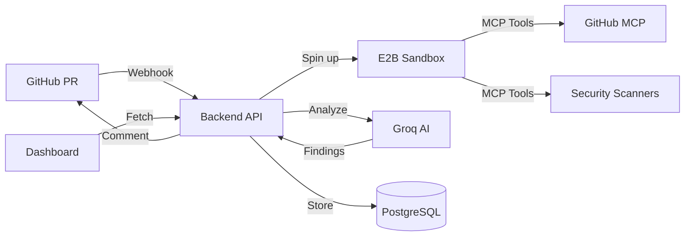

# 🛡️ AI Compliance Copilot

An AI-powered compliance assistant that automatically analyzes GitHub PRs for security vulnerabilities, license compliance, code quality issues, and custom company rules. Powered by E2B sandboxes, MCP integrations, and Groq AI.


## ✨ Features

### 🔒 Security Analysis
- Automatic detection of hardcoded secrets (API keys, passwords, tokens)
- SQL injection and XSS vulnerability scanning
- Weak cryptography identification
- Dangerous function usage detection (eval, exec)

### 📜 License Compliance
- GPL violation detection
- Missing license header identification
- Open source license compatibility checking
- Proprietary code protection

### 🎯 Code Quality
- Cyclomatic complexity analysis
- Code smell detection
- Best practice validation
- Maintainability scoring

### ⚙️ Custom Rules
- Configurable regex patterns
- Company-specific policy enforcement
- Banned dependency detection
- Custom severity levels

## 🏗️ Architecture



### Tech Stack

- **Backend**: Node.js + TypeScript + Express
- **AI**: Groq (llama-3.1-70b-versatile)
- **Sandboxes**: E2B Code Interpreter
- **Integrations**: MCP (Model Context Protocol)
- **Frontend**: Next.js 14 + Tailwind CSS + shadcn/ui
- **Database**: PostgreSQL + Redis
- **Deployment**: Docker + GitHub Actions

## 🚀 Quick Start

### Prerequisites

- Node.js 18+ and npm 9+
- Docker and Docker Compose
- GitHub App credentials
- E2B API key
- Groq API key

### Installation

1. **Clone the repository**
```bash
git clone https://github.com/yourusername/ai-compliance-copilot.git
cd ai-compliance-copilot
```

2. **Install dependencies**
```bash
npm install
```

3. **Setup environment variables**
```bash
cp .env.example .env
# Edit .env with your API keys and credentials
```

4. **Start services with Docker**
```bash
docker-compose up -d postgres redis
```

5. **Run database migrations**
```bash
npm run migrate --workspace=backend
```

6. **Start development servers**
```bash
npm run dev
```

The backend will be available at `http://localhost:3001` and the frontend at `http://localhost:3000`.

## 📖 Documentation

- [Architecture Guide](./docs/ARCHITECTURE.md) - Detailed system design and E2B/MCP integration
- [API Reference](./docs/API.md) - REST API endpoints and webhook schemas
- [Deployment Guide](./docs/DEPLOYMENT.md) - Production deployment instructions
- [Custom Rules](./docs/CUSTOM_RULES.md) - Writing and configuring custom compliance rules

## 🧪 Demo Repositories

This project includes three sample repositories with intentional compliance issues:

- **vulnerable-ecommerce** - E-commerce app with hardcoded secrets and SQL injection
- **corporate-backend** - API server with license violations and code quality issues
- **crypto-wallet** - Cryptocurrency wallet with weak cryptography and security flaws

See [demo-repos/README.md](./demo-repos/README.md) for details.

## 🛠️ Development

### Project Structure

```
ai-compliance-copilot/
├── backend/              # Node.js API + E2B agent
│   ├── src/
│   │   ├── agent/       # E2B sandbox orchestration
│   │   ├── analysis/    # Groq AI integration
│   │   ├── compliance/  # Rules engine
│   │   ├── github/      # GitHub App handlers
│   │   └── api/         # REST API routes
│   └── tests/           # Backend tests
├── frontend/            # Next.js dashboard
│   ├── app/            # App router pages
│   ├── components/     # React components
│   └── lib/            # Utilities
├── demo-repos/         # Sample vulnerable repos
├── docs/               # Documentation
└── docker-compose.yml  # Local development stack
```

### Running Tests

```bash
# Run all tests
npm test

# Run backend tests only
npm test --workspace=backend

# Run with coverage
npm test -- --coverage
```

### Building for Production

```bash
# Build all workspaces
npm run build

# Build Docker images
docker-compose build
```

## 🚢 Deployment

### Deploy with Docker

```bash
docker-compose up -d
```

### Deploy to Cloud

See [docs/DEPLOYMENT.md](./docs/DEPLOYMENT.md) for detailed instructions on deploying to:
- Railway (recommended for backend)
- Vercel (recommended for frontend)
- AWS/GCP/Azure

### GitHub App Setup

1. Create a new GitHub App at https://github.com/settings/apps/new
2. Set webhook URL to `https://your-domain.com/api/webhook`
3. Configure permissions (see [docs/DEPLOYMENT.md](./docs/DEPLOYMENT.md))
4. Generate and download private key
5. Update `.env` with App ID and private key

## 📊 Usage

### Automatic Analysis

Once installed, the bot automatically analyzes PRs when:
- A new PR is opened
- An existing PR is updated
- Someone pushes new commits

### Manual Commands

Comment on any PR with:
- `@compliance-bot scan` - Trigger manual analysis
- `@compliance-bot fix` - Create a PR with automated fixes
- `@compliance-bot ignore <rule>` - Ignore specific findings

### Dashboard

Access the dashboard at `http://localhost:3000/dashboard` to:
- View analysis history
- Configure custom rules
- Monitor compliance statistics
- Manage repository settings

## 🤝 Contributing

Contributions are welcome! Please read our [Contributing Guide](./CONTRIBUTING.md) for details.

1. Fork the repository
2. Create your feature branch (`git checkout -b feature/amazing-feature`)
3. Commit your changes (`git commit -m 'Add amazing feature'`)
4. Push to the branch (`git push origin feature/amazing-feature`)
5. Open a Pull Request

## 📝 License

This project is licensed under the MIT License - see the [LICENSE](./LICENSE) file for details.

## 🙏 Acknowledgments

- [E2B](https://e2b.dev) - Sandboxed code execution
- [Groq](https://groq.com) - Fast AI inference
- [MCP](https://modelcontextprotocol.io) - Model Context Protocol
- [shadcn/ui](https://ui.shadcn.com) - UI components

## 📧 Support

- 📖 Documentation: [docs/](./docs/)
- 🐛 Bug Reports: [GitHub Issues](https://github.com/yourusername/ai-compliance-copilot/issues)
- 💬 Discussions: [GitHub Discussions](https://github.com/yourusername/ai-compliance-copilot/discussions)

---

Built with ❤️ for the E2B + MCP Hackathon

